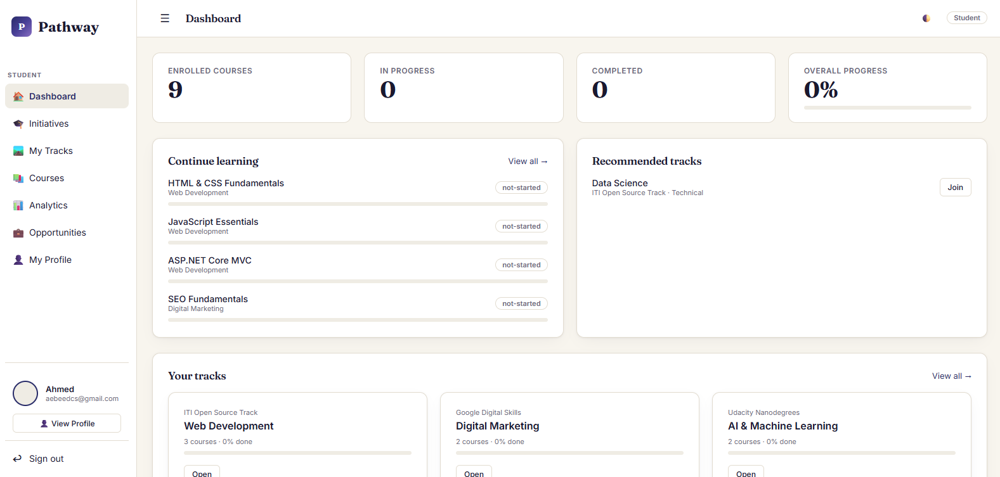
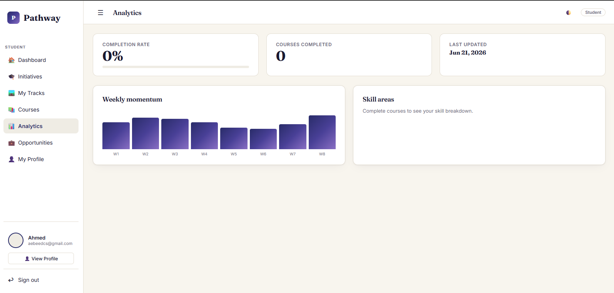
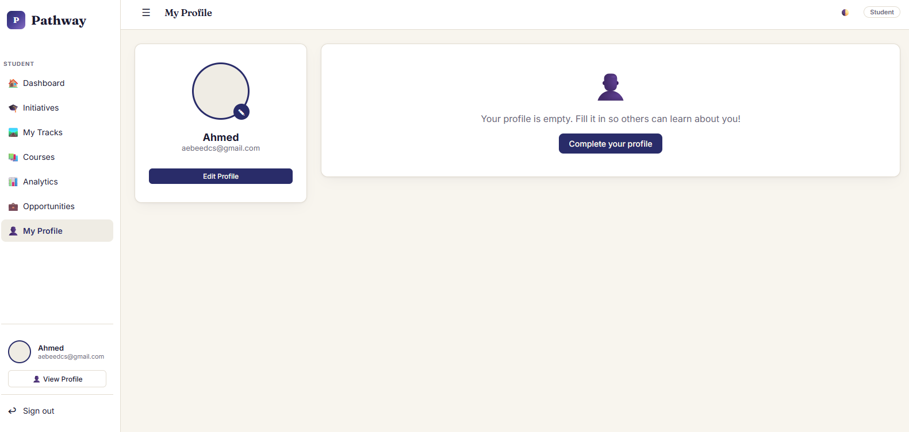
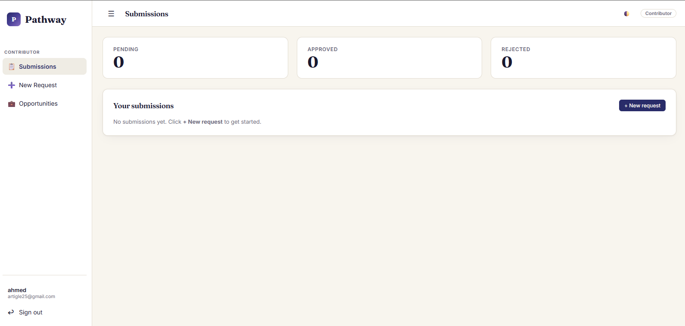
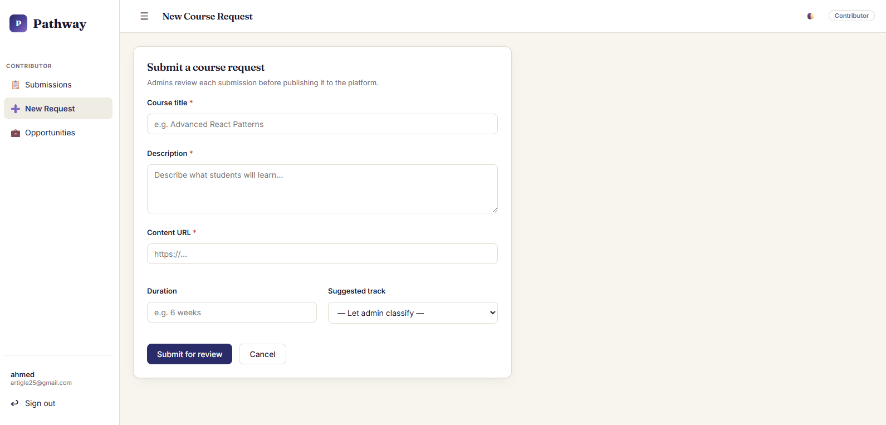

# Pathway — Student Tracking & Evaluation Platform

> Bridging the gap between intensive tech bootcamps and real professional opportunities.

---

## 📖 Project Idea

**Pathway** is an end-to-end digital ecosystem that tracks a student's full journey — from the moment they're enrolled into a technical **Track** under a training **Initiative**, through every attended session, all the way to being matched with a real job or internship **Opportunity** from a corporate partner.

Instead of scattered spreadsheets and manual grading, Pathway gives training academies one live, centralized system: instructors log performance data, the platform avaliables each student's standing, and qualified students are surfaced to recruiters — turning training outcomes into hiring outcomes.

Built for **Ministry of Communications** by team **GHR4 — SWD5 — S2 — Project 1**.

## 🎯 Project Objectives

- **Eliminate progress fragmentation** — replace scattered spreadsheets and manual grading with one unified, real-time dashboard.
- **Self Progress-Based Scoring** — students earn points by completing course sections and milestones, allowing them to track their progress and gradually increase their overall score.
- **Opportunity matching** — Contributor post job/internship Opportunities; the system surfaces relevant ones to qualified students based on their track performance.
- **Student analytics dashboard** — a centralized view of grades, attendance compliance, and track completion in real time.
- **Student enrollment & progress tracking** — students enroll into Tracks; their academic record and progress are tracked from day one.

## 🛠️ Technologies Used

| Layer            | Technology                                                                                                       |
| ---------------- | ---------------------------------------------------------------------------------------------------------------- |
| Backend          | ASP.NET Core MVC (C#)                                                                                            |
| Data access      | Entity Framework Core — Code-First, with migrations                                                              |
| Frontend         | Razor views, Bootstrap, jQuery, jQuery Validation (unobtrusive)                                                  |
| Custom scripting | Vanilla JS (`wwwroot/js/pathway.js`) for theming & opportunity filtering                                         |
| Database         | Relational database via EF Core _(confirm exact provider — SQL Server / SQLite / other — in `appsettings.json`)_ |

## 🚀 How to Run the Project

> These are the standard steps for an ASP.NET Core MVC + EF Core (Code-First) project. Please confirm the exact connection string / database provider in `appsettings.json` and adjust if needed.

1. **Clone the repository**
   ```bash
   git clone https://github.com/ItcProjects-R4/GHR4_SWD5_S2_PROJECT1.git
   cd GHR4_SWD5_S2_PROJECT1
   ```
2. **Open the solution** in Visual Studio (or open the folder in VS Code with the C# extension).
3. **Restore dependencies**
   ```bash
   dotnet restore
   ```
4. **Configure the database connection** — set your connection string in `appsettings.json` (or `appsettings.Development.json`).
5. **Apply migrations to create the database**
   ```bash
   dotnet ef database update
   ```
6. **Run the project**
   ```bash
   dotnet run
   ```
   or press **F5** in Visual Studio. The app will open at `https://localhost:<port>` (port shown in the console output).
7. **Seeded sample data** — `DataSeeder.cs` pre-populates sample Users, Student Profiles, Initiatives, and Opportunities so you can explore the app immediately. Check `Models/DataSeeder.cs` for the exact seeded accounts.

## 📸 Screenshots

### Student Experience

**Dashboard** — enrolled courses, in-progress/completed counts, overall progress, continue-learning list, recommended and active tracks.


**Analytics** — completion rate, courses completed, weekly momentum chart, and skill-area breakdown.


**My Profile** — student profile summary and quick edit access.


### Contributor Experience

**Submissions** — pending / approved / rejected counts and a list of the contributor's own course submissions.


**New Course Request** — form for submitting a new course (title, description, content URL, duration, suggested track) for admin review.


## 🗂️ Project Structure

```
GHR4_SWD5_S2_PROJECT1/
├── WebApplication10.sln
├── WebApplication10/
│   ├── Controllers/        # AdminController, ContributorController, StudentController, HomeController, AuthHelper
│   ├── Models/              # AppDbContext, DataSeeder, domain entities (Course, Track, Initiative, Opportunity, User, ...)
│   │   └── ViewModels/      # Dashboard, login, and detail view models passed to Razor views
│   ├── Migrations/          # EF Core Code-First migration history
│   ├── Pages/                # Razor Pages (Error, Index, Privacy)
│   ├── Views/                # Razor views rendered by the controllers
│   └── wwwroot/
│       ├── lib/               # Vendored frontend libraries (Bootstrap, jQuery, jQuery Validation)
│       └── js/pathway.js      # Custom app JS — theme toggling & opportunity filtering
├── docs/
│   ├── requirements/        # Software Requirements Specification
│   ├── presentation/        # Project presentation (.pptx)
│   └── gantt-chart/          # Project Gantt chart, if available
├── screenshots/              # App screenshots used in this README
└── README.md
```

## 🧩 Challenges Faced During Development

-
-
-

## 🔮 Future Improvements

- Expand the matching engine with more granular skill-tag based recommendations.
- Add notifications (email/in-app) for grade updates, request approvals, and new matching opportunities.
- Implement optimistic concurrency (`RowVersion`) on grade/attendance updates to safely support multiple instructors editing the same record.
- Add richer analytics and reporting for Admins (cohort comparisons, track completion trends).

## 👥 Team Members

- Youssef El-Kholy
- Ahmed Ebeed
- Hagar Mahmoud
- David Shady
- Mohamed Mostafa
- Menna El-Shazly

**Company:** ITC

## 🎬 Demo Video

[Demo video link here]

## 📄 Requirements Document

The full Software Requirements Specification is available at [`docs/requirements/`](docs/requirements/).

## 📊 Presentation

The project presentation Link is available at [`https://canva.link/i10qd8mr0arnkh6`](https://canva.link/i10qd8mr0arnkh6).
